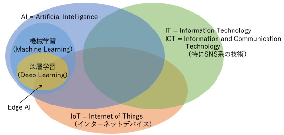

## 自己紹介

丸山 哲太郎

* 東京大学大学院工学系研究科 修了
* 富士通研究所
    * 大規模ストレージの研究開発
* リクルートコミュニケーションズ
    * Data Scientist / Machine Learning Engineer / Data Engineer
* メルカリ
    * Machine Learning Engineer / Engineering Manager
* TechnoFACE
    * Data Scientist / General Manager

## Schedule

* １日目：座学
    * なぜAIを使うのか、その意義と必要性
    * ２日目・３日目で使う、データ分析の学習
* ２日目：ディスカッション
    * データ分析を用いて業務上の問題を解決する方法の策定
    * みなさまから寄せられた問題についてディスカッション
* ３日目：ハンズオン
    * 実際にプログラムを動かして、実際のデータ分析を体験

## Agenda（１日目）

* 導入
    * AIとは何か
* ビジネスにAIを用いる
    * AIの意義
* AIが出来ること/出来ないこと
    * AIの種類
* データ分析の流れ
    * データの前処理
* AIを作る
    * AIモデルの説明
* データ分析の効果を測る
    * 指標

# 導入

## 最も基本的な疑問

* 「そもそもAIって何ですか」
    * きちんと言葉の意味を調べて解説
* 「AIは人間の仕事を奪いますか」
    * 例を挙げて解説

## AIとは何か

* AI: Artificial Intelligence（人工知能）
    * "Intelligence demonstrated by machines"
        * from Wikipedia(en) "Artificial Intelligence"
    * コンピューターによって実現される『知能』
* Intelligence（知能）
    * "The ability to perceive or infer information, and to retain it as knowledge to be applied towards adaptive behaviors within an environment or context"
        * from Wikipedia(en) "Intelligence"
    * ある環境・状況下において、適切な行動を取れるような知識として、\newline 情報を認識・推論・保持できる能力

## AI の一例

ログインシステム

* あらかじめユーザー名とパスワードがデータベースに登録されている
    * ← 情報の保持
* ユーザーがユーザー名とパスワードを入力する
    * ← 情報の認識
* ユーザー名とそのパスワードが登録されているものと一致する
    * ← 情報の推論
* そのユーザーがシステムの機能を使えるようにする
    * ← 適切な行動
* **立派な「AI」**

## AI という言葉の意味

**「AI」は「IT」と同じぐらいの意味**

## AI で人間の仕事は無くなる？

* **絶対に、無くなりません**
    * 幸か不幸か、私の仕事が無くなることは、ほぼ無いでしょう
    * AI（機械学習）には、人間が行うことが山程あるから

## 納豆を初めて発見した人

（源義家説）

* 平安時代の中頃、東北地方で反乱があり、それを治めるため平泉に
* 農家から貰った大豆を煮ていた
* (K)急に(T)敵が(A)現れた！
* 煮ていた豆を急いで藁にくるみ、馬に乗せたりして持ち歩く
* 落ち着いた後に藁を解いてみると、ネバネバしているし、臭いも酷い
* 完全に腐ってると思うけど、もったいないから食ってみる
* うまい！

## 納豆を大量生産したい

業務課題：「納豆を作る方法を確立する」

考え得る条件：

* 大豆の処理：大豆そのまま、煮る、焼く、すり潰す、etc...
* 大豆の管理：そのまま、藁にくるむ、樽に入れる、布袋に入れる、etc...
* 大豆の保管：野ざらし、小屋に入れる、馬に載せる、人が担ぐ、etc...
* 大豆の保管期間、etc, ...

## 納豆の作り方の確立

## 納豆作りをAIでやるならば

## AIに必要なもの

* 人間の知見・経験を変換したデータ
    * AIはどんなデータが必要か分からない
    * 人間が作る必要がある
* 大量のデータ
    * 全部のデータを人間が作るのは困難
    * デジタル化・IT化が必要
* 正解データ
    * 何が人間にとって有用なのか（正解なのか）分からない
    * 人間が判断する必要がある

## AI（機械学習）とは

* 人間がやるには大変なことを肩代わりする「便利ツール」
* AI自体はデータから導かれた結果を出すだけのもの
    * 納豆が発酵するように、データを機械的に計算しているだけ
* AIが人間に有用なものになるよう、導き育てる必要がある
    * AIが人間が求める結果を出すよう、人間がデータを整え、学習の方向を決めなければならない

よって

* あくまで人間が主体
* 人間が行う仕事の質・内容が変わるだけ
* 人間の関与が不可欠

# ビジネスにAIを用いる

## ビジネスにAIを用いる

* なぜビジネスにAIを用いるのか
    * ビジネスにAIを用いるメリット・デメリット
    * AI導入が成功するパターン・失敗するパターン
* **ビジネスにAIを導入する意義**

## AIを用いるメリット

* （単純作業である）人的工数の削減
    * 他の新規開発・創造的業務に人的工数を当てることが出来る
* データという客観的事実による判断
    * 熟練者でなくても業務を遂行することが可能
    * 経営的判断にも使うべき
* データからルールを自動的に作成
    * 実際にはまだ起こっていない状況からの結果を「予測」できる
        * 新規発見、将来予測
* 人間が把握出来ないルールの発見
    * 大量のデータから正しいルールを導き出す
    * ただし、ほとんどの場合が「当たり前の結論」
        * 砂漠の中に埋もれた一粒のダイヤモンドを探すよう
* 宣伝材料になる

## AIを用いるデメリット

* 学習をするための大量のデータが必要
    * 所謂「ビッグデータ」
* データがデジタル化されていることが必要
    * AIが扱えるのはデジタル化されたデータのみ
    * AIが使うデータだけではなく、社内のあらゆることがデジタル化され、それが常に監視（モニタリング）できる状態であることが理想
* 下分析が必要で、これだけでも時間とお金がかかる
    * データを分析してみないと何も分からない
* 効果が出るまでに時間がかかる
    * 即改善することは稀。徐々に変わっていく
* 継続的に監視・改善していくことが必要
    * 環境・人間は徐々に変わっていく

## AI導入が成功するパターン

* 既に業務全体のデジタル化(DX)が完了している
* 人手でやっている困難・煩雑な作業の工数削減をまずは目指す
* 完全にAIに任せるのではなく、人間のサポート的な役割から始める
* しっかりと下分析を行ってから実際の業務に導入する
* 定期的にデータを見て判断する、というシステムおよび習慣がある
* 短期間で短絡的に判断せず、長期的な視点で判断する
* 分析から得られた点から徐々に難しいことに応用していく

## AI導入が失敗する典型例

* 「AIをやる」ことが目的となっている
    * AIはただの手段。手段と目的を履き違えない
* いきなり難しい事・理想の事をやろうとする
    * まずは簡単な事・導入しやすい事から始める
* データはあるが、紙の書類のみ
    * まずはデジタル化を行う
* 結果をすぐに求める
    * 下分析が必要
    * 学習し予測した結果が効果を発揮するまでには時間がかかる
* 作ったらそれで完了だと思う
    * 結果を常に観察し続ける必要がある
    * データを常に更新し、新しいデータに対して学習し続ける必要

## ビジネスにAIを導入する意義

* 人間の工数を削減する
    * IT と同じレベル
* データという客観的事実に基づく判断を行う
    * 勘や経験といった明文化されていないものに頼らない
* 環境や状況の変化に対して即座に対応する
    * 自動的にデータが蓄積・学習されている
    * その結果を常に監視し、判断する
* 新しい発想・技術を積極的に採用し、自分自身が変化できる体質になる

変化が大きく激しい時代の中で、コスト（時間・お金）をかけてでも、\newline
自己変革し、継続・発展していくという意思を持たなければならない。

## 実際にビジネスにAIを導入する

AI導入にあたり、よく問題となる点

* 急激な改革（AI導入）が反発を生む
* AI導入のコストが大きすぎて、逆に企業としての体力が弱る

「AI を導入する」ではなく「何をどう AI 化するのか」が重要

* 小さな問題から、着実に改善し利益をあげていく
    * AI化を出来る/出来ない もしくは すべき/すべきではない
    * AI化したら何がどう良くなって、それは満足できる改善なのか
    * そもそもAIが使えるデータは存在するのか
    * AIは何を改善し、その結果はビジネスにどう結びつくのか

（２日目にみなさまがお持ちの課題についてディスカッションします）

# AIが出来ること/出来ないこと

## AIを導入する際に考えるべきこと

* ビジネス上の課題（問題点、実現したいこと）が存在する
* 人間がそれを解決する場合はどうするかを考える
    * 人間が（無限の時間をかけても）出来ないことは、AI でも出来ない
* AI以外の方法でそれを解決できるかどうかを考える
* AIでそれが実現できるかどうかを考える

AIにはどのようなものがあり、何が出来るかを理解しなければならない

## AIの種類

* ルールベース（ほぼITなAI）
    * 人間が作ったルールに則って、情報を処理する
        * 例：「登録されたユーザーなら使ってOK」
* 最適化
    * 資源を、ある条件に従い、最適になるよう分配する
        * 例：「バイトのスケジュールを自動的に調整する」
        * 学習は行わない
* 機械学習（狭義のAI）
    * データを学習し、そこからルールを発見し、情報を処理する
    * **今回のターゲット**

## 人生ゲーム

各自が自分の作ったルーレットを持ち込んで、人生ゲームをする。

* 人生ゲームをゴールする＝ビジネス課題（目的）
* 独自のルーレットを作る＝作るべきAI

## 人生ゲームのゴールとルーレット

* とにかく最速でゴールする！
    * 必ず10が出るルーレットを作る
    * → **ルールベース**
        * 単純なルールを守り動作するシステム
        * 期待する出力が一定
* あまり派手になり過ぎなく、それでいて最速にゴールする
    * 直近5回で合計が40になるルーレットを作る
    * → **最適化**
        * 限られた資源の中で最大の成果を得たい
        * 期待する出力は不定
* 両者とも、バグ無く動作すれば使い続けることが出来る

## AIルーレット

人生ゲームは最速でゴールすることだけが目的ではない。

* 人生ゲームをどのようにゴールしたいか（**要件**）
    * 所持金が最大、子供が最多、etc. etc...
* 要件を表すデータは何か（**目的変数**）
    * 所持金の額、子供の数、etc. etc...
* 要件を満たす予測のために必要なデータは何か（**特徴量**）
    * 駒の位置、升目の内容、etc. etc...
* 要件が満たされているか判断するデータは何か（**指標**）
    * メンバーの中での所持金ランキング、etc. etc...

## AIルーレットに必要なもの

* 要件が明確に決められている
    * 所持金最大！
* 目的変数、特徴量のデータ
    * 過去のゲームの内容と、その結果
    * 大量に！
* 指標の計算と、それがどのような値になるべきかの判断
    * 所持金が最大？どれぐらい差を付けたい？

これらを元に、「統計的に」最適解を予測するのが、AI。

* 完全なデータが無くても、データから最適解を予測する
* あくまで統計的なものであるため、間違うこともある
* なので、常に監視し、適宜判断することが必要

## 本当にAIが必要ですか？

* 本当に必要なものは何ですか？
    * 結局、一番早くゴールしたいのでは？
* それはAIでしか実現できませんか？
    * 8,9,10 だけをランダムで出すルーレットだって可能
* コストをかけてAIを作るメリットはありますか？
    * あらかじめ分析をして十分なメリットが得られるか確認（下分析）
* AIでなくとも、指標を常に監視することは必要
    * → **データドリブン**
    * 優先度は、DX→データドリブン→AI

**AIを使わないという判断**も重要

## 機械学習の種類（扱うデータ）

データの種類

* 構造化データ
    * テーブルデータ（Tabular Data (例) Excel, CSV）
* 非構造化データ
    * テキストデータ、画像データ、音声データ

扱うデータによる機械学習の種類

* テーブルデータ → 一般的な機械学習
* テキストデータ
    * 「自然言語処理」（NLP: Natural Language Processing）
* 画像データ
    * 「画像処理」（Image Processing）

## （余談）一般的な機械学習の更に細かい分類

* データが時系列データ
    * 株価を予測したい
    * 「時系列解析」（Time-Series Analysis）
* 各々の特徴量が結果にどのような影響を与えるか知りたい
    * 宣伝メール送信を100人増やしたら、販売数がどれだけ増えるか予測したい
    * 「因果解析」（Causal Analysis）
* 特徴量間の暗黙的な関係・因子を知りたい
    * アンケート結果から、20代女性が好む商品要素を特定したい
    * 「共分散構造解析」（Covariance Structure Analysis）

それぞれが難しい手法であり、すべてをマスターする人は非常に少ない。

## 機械学習の種類（教師データ）

目的変数（教師データ、正解データ）が存在しない場合もある。

* 教師データがある
    * 「教師あり学習」（Supervised Learning）
* 教師データが無い
    * ユーザーを３つのタイプに分類する
    * 「教師なし学習」（Unsupervised Learnig）
* 学習には（とりあえず）正解があるが、予測結果には正解が無い
    * 写真をモネ風に変換する
    * 「半教師あり学習」（Semi-Supervised Learning）
* はっきりとした正解は無く、スコアのみが存在する
    * AI将棋、Alpha GO
    * 「強化学習」（Reinforcement Learning）

## 機械学習の種類（目的）

実際に機械学習に何をさせるか、その目的によっても種類が異なる。

* データを分類する（教師あり学習）
    * 「分類」（Classification）
* データの値を予測する（教師あり学習）
    * 「回帰」（Regression）
* データをグループ分けする（教師なし学習）
    * 「クラスタリング」（Clustering）
* データを生成する（半教師あり学習）
    * 「生成」（Generation）

下に挙げたものほど、難しい

## 機械学習の種類（目的）

[japatpoint.com](https://www.javatpoint.com/regression-vs-classification-in-machine-learning)より引用

## 機械学習の種類（手法）

* Neural Network を使わないもの
    * Shallow Learning
* Neural Network を使うもの
    * Deep Learning（深層学習）

Deep Learningはすべての問題に適用できることが理論的に証明されているが、
すべてのケースで Deep Learning が最善とは限らない。

また、Deep Learningは学習が難しかったり、より計算能力の高いマシン（GPU）
が必要だったりする。

## AIが出来ること/出来ないこと

* ビジネス上の課題（問題点、実現したいこと）が存在する
* 人間がそれを解決する場合はどうするかを考える
    * 人間が（無限の時間をかけても）出来ないことは、AI でも出来ない
* AI以外の方法でそれを解決できるかどうかを考える
    * AI以外の方法で解決できるなら、それに越したことはない
* AIでそれが実現できるかどうかを考える
    * 今までに挙げた機械学習の種類のうち、必要なものはどれか
        * データの種類はどれか
        * 目的変数はあるか
        * ビジネス課題を解決するために何が必要か

## ビジネス課題を解決するために必要なもの

* 例）中古車の販売価格をAIで決める
    * AIを用いる意義
        * 価格査定の人的コストを削減する
        * 価格査定担当者のスキルに依存しない、市場と連動した価格設定
    * → 「回帰」を使おう
        * →価格を正確に予測することは非常に困難→頓挫
    * 正確な販売価格は本当に必要だったのか
        * 価格帯を示すだけでも、人的コスト削減の効果は十分
        * 同様の中古車の、最新の市場価格を簡単に参照出来れば良い
    * 方針の再策定
        * 価格の「回帰」ではなく、価格帯の「分類」を行う
        * システムで市場価格の参照を行うなど、実装と運用でカバー
    * データとノウハウを蓄積し、将来の完全AI化を目指す

## AIが出来ること/出来ないこと/しないこと

* ビジネス上の課題（問題点、実現したいこと）が存在する
* 人間がそれを解決する場合はどうするかを考える
    * 人間が（無限の時間をかけても）出来ないことは、AI でも出来ない
* AI以外の方法でそれを解決できるかどうかを考える
    * AI以外の方法で解決できるなら、それに越したことはない
* AIでそれが実現できるかどうかを考える
    * 今までに挙げた機械学習の種類のうち、必要なものはどれか
        * データの種類はどれか、目的変数はあるか
        * ビジネス課題を解決するために何が必要か
* もっと簡単に、もっと効果的に実現出来ないか考える
    * AIの役割を必要最小限に留め、より簡単な手法で実現する
    * 人間のサポートの役割に留める、システム・運用でカバーする

# データ分析の流れ

## 本セミナーのターゲット

* データ：テーブルデータ
* 教師データ：あり
* 目的：分類・回帰
* 手法：Shallow Learning

## データ分析の流れ

1. データを入手し、PC上で扱える状態にする
2. データの前処理を行う
3. モデルを作成する
4. 評価を行う
5. 2-4を、満足な結果が得られるまで繰り返す

実際のデータ分析業務では、データ前処理が占める割合が８割。

## 前処理

データによって行うべき前処理は多岐に渡るが、
下記のものを一通り検討すれば、とりあえず十分だと思われる。

* データ種別と分布の確認
* 相関のチェック
* カテゴリ変数のダミー変数化
* 欠損値・異常値・重複の確認と処理
* 特徴量エンジニアリング
* 特徴量削減・次元圧縮
* データの正規化

## 前処理

全部重要なのだが、特に重要なのは以下

* （重要！）データ種別と分布の確認
* （重要！）相関のチェック
* （重要！）カテゴリ変数のダミー変数化
* （重要！）欠損値・異常値・重複の確認と処理
* 特徴量エンジニアリング
* 特徴量削減・次元圧縮
* （重要！）データの正規化

## データ種別

各データ（目的変数・特徴量）が数値であっても以下の種別が存在する。

* 連続変数
    * 整数もしくは実数で、値の大小および値の差に意味がある
    * 例）1.2cm, 354g, 5200円
* 順序変数
    * 整数で、値の大小には意味があるが、値の差には意味が無い
    * 例）メロンの美味しさを5段階で評価した値
* カテゴリ変数
    * 整数で、値の大小にも差にも意味はなく、値の違いにしか意味が無い
    * 例）花の色を赤なら1, 青なら2, 黄色なら3 としたもの

各データがどのような意味で、上記のどれかを確認する必要がある。

## 分布の確認

* カテゴリ変数・順序変数は、何種類のカテゴリがあり、\newline 各カテゴリに何%のデータが属するかを調べる
    * あまりにもカテゴリ数が多い場合は、カテゴリの統合等を考える
    * 属するデータがあまりにも少ないカテゴリは無視する必要があるかも
    * 各カテゴリに属するデータ数が偏っている場合、注意が必要
* 連続変数は、ヒストグラムを描き、どのような分布に従うかを見積もる
    * 正規分布（ガウス分布）
        * 扱いやすい
    * ポアソン分布
        * あまり起こらない事象が従う分布。扱いは少し難しい
    * べき分布（Zipf分布）
        * 自然界に存在するものが従う分布。扱いは非常に難しい

## 分布の種類

## 相関のチェック

* ２種類の値の間に相関がある場合、良いケースと悪いケースがある
* （良いケース）目的変数と、ある特徴量に相関がある
    * 正の相関・負の相関に関わらず
    * その特徴量は目的変数を予測する上で重要なデータ
* （悪いケース）特徴量間に相関がある
    * どちらかの特徴量を削除しなければならない
* 散布図もしくはヒートマップを作成し、確認することが必要

## 相関のチェック

\begin{center} 散布図の場合 \end{center}

## データの落とし穴１：マルチコ

* 特徴量間に相関がある＝その特徴量は同じような意味
    * 予測をしても、どの特徴量が寄与したのか分からなくなる
* （数学的意味）特徴量行列の逆行列がランク落ちする
    * Shallow Learningモデルの中には逆行列を使うものがある
    * 逆行列がランク落ちすると結果が不定になる
* 多重共線性（Multi-collinearity：愛称「マルチコ」）
* マルチコは必ず排除しなければならない
    * 相関が高い特徴量のどちらかを削除する

## カテゴリ変数のダミー変数化

* 特徴量の中にカテゴリ変数が含まれる場合、どのモデルもそのままでは使えない
* カテゴリ変数をダミー変数化する
    * カテゴリ変数内のカテゴリ数だけ、バイナリ変数を作る
        * バイナリ変数：0と1だけのカテゴリ変数
    * 例）赤=1, 青=2, 黄=3 というデータの場合
        * 赤, 青, 黄 という３つのバイナリ変数を作る
        * 2のデータは(赤,青,黄)=(0,1,0)のように変換する
    * バイナリ変数ならば、通常の連続変数と同様に扱える
    * 元からバイナリ変数であるならば、必要ない

## ダミー変数化におけるマルチコ

* 例えば、赤=1, 青=2 というデータをダミー変数化する
    * 1 = (1, 0), 2 = (0, 1)
* これらの特徴量は必ず相関係数が -1 になる（負の相関）
    * 青は、赤の0を1に、1を0に変えただけ
    * このままダミー変数化したものを使うと、マルチコが発生
* **ダミー変数化を行う場合は、必ずカテゴリをひとつ落とす**
    * 例）赤=1, 青=2, 黄=3 というデータの場合
        * 赤, 青 という２つのバイナリ変数だけで良い
        * 黄は、赤と青の両方が0のもの、と表すことが出来る
        * 情報量は落ちていない

## 欠損値・異常値・重複

* 欠損値：データの歯抜け
    * 補完する方法もある
    * 基本的に捨てましょう
* 異常値：そのデータ点だけ異常に大きい・小さい
    * 2.5$\times$四分位範囲の外のデータを異常値とする
        * 箱ひげ図
    * 分布を見て考える
    * 基本的に捨てましょう
* 重複：同じデータが何度も出てくる
    * 基本的に捨ててユニークにしましょう

## 箱ひげ図

## データの落とし穴２：leakage

* 例）新規ユーザーと長期ユーザーを分類したい
    * データの中に、ユーザーID等が含まれていた
    * ユーザーIDは通番で付けられていた
    * ユーザーIDが小さいユーザー！
* 正解に繋がるデータが特徴量の中に含まれている
    * ズルだし、分析として意味がない
* 漏えい（leakage）
* leakageとなり得るデータは削除してから、重複除去をする

## 特徴量エンジニアリング

* 既にあるデータから新しいデータを作る
* 単純に足し合わせたり掛け合わせるのは、お薦めしない
    * 効果があった試しがない
* 対数化
    * べき分布を示す特徴量は対数化する
* 離散化
    * 連続変数をカテゴリ変数（バイナリ変数）に変換する
    * 経験や知見をここに活かせる場合が多い
        * 週３回以上アクセスするユーザーが商品を買ってくれる\newline →アクセス頻度というデータを週３回以上アクセスするか否かに変換
    * 木系のモデルで予測を行い、その分割結果から離散化

## データの落とし穴３：次元の呪い

* N次元の直方体とそれに内接する球があったとする
    * ２次元なら正方形と円、３次元なら立方体と球
* 立方体に満遍なく点があった時に、どれぐらいが球の中にあるか
    * ２次元の場合は、ほとんどが円の中に入るだろう
    * ３次元の場合は、２次元に比べて隙間が多いので、球からはみでる
* ではもっと次元数が大きくなったら？
    * 無理やり球で考えると、立方体はトゲトゲのウニみたいな形になる！

## 次元の呪いは何が問題なのか

* いくらデータを揃えても、そのデータはほとんど空間のすみっこに存在し、疎（sparse：スカスカ）な状態になる
    * これではまともな分析は出来ない
* 空間をスパっと２つに分けることを考えると、ちょっとでも切る位置や角度が違うだけで全然違う結果になってしまう
    * 微妙な誤差が結果に深刻な影響を与えてしまうので、これではまともな分析は出来ない
* 特徴量削減・次元圧縮などを行う

## 特徴量削減

* 一般的に知られているが、個人的にはあまり良くないと思う方法
    * 目的変数との相関係数が小さい特徴量を削除
        * 陰相関を無視している
    * 線形重回帰でｐ値が低い特徴量を削除
        * ｐ値は偏回帰係数の有意性を示しているだけ
    * RandomForestのfeature importanceが低い特徴量を削除
        * 木の数や深さが十分でない場合に危険
* 良い方法
    * 特徴量をひとつずつ増やし/減らし、精度が最も良い組合せを選ぶ
        * 反復特徴量選択（wrapper method）
    * LASSOを用いる
        * 多重線形回帰においてペナルティとして各係数の和を用いる

## 次元圧縮

* 次元圧縮とは
    * データを変形し、有効だと考えられるデータのみを抽出する
    * 影響が大きい成分を抽出するので、精度向上が見込める
    * 元のデータを変形するので、何が効いたのか分かりにくくなる
* 次元圧縮の手法
    * PCA（主成分分析：Principal Component Analysis）
        * データをくるくる回転させて、分散が大きいデータを抽出
    * SVD（特異値分解：Singular Value Decomposition）
        * 固有値が小さい（影響が小さい）成分を切り捨てる
    * NMF（非負値行列因子分解：Non-Negative Matrix Factorization）
        * 行列を良いカンジにザクッとふたつに分ける

## データを学習用・評価用に分ける

* 学習に使ったデータをそのまま予測し、精度を評価しても、\newline 「そのデータだけで良い結果が出る」のかもしれない
* そこで、データを学習用と評価用に分ける
    * 一般的には7:3ぐらいに
* 目的変数がカテゴリ変数（分類）の場合、学習用と評価用のデータにおけるカテゴリの割合が同じくらいになるよう分けることが大切
    * 「色が黄色の花」のデータが評価用データにだけあり学習用データになければ、そもそも「色が黄色の花」を予測することが出来ない
    * 学習用データのほとんどが「色が黄色の花」だったのに、評価用データの殆どが「色が青色の花」だったら、まともな予測・評価にならない
    * "Stratify"

## データの正規化

* 35cmと35gは、同じ35という値で良いのか
    * 値の大小と差には興味があるが、値そのものには興味がない
* 特徴量をすべて「平均0 分散1」になるよう変換する
    * 「正規化」
    * 平均を引いて標準偏差で割れば良い
    * バイナリ変数も正規化して良い
* データを学習用・評価用に分けた場合、評価用のデータの正規化には、学習用データの平均と分散を使わなくてはならない
    * 標準と分散も含めて「モデル」
    * 別々に正規化すると、学習用データの値と評価用データ値がズレる
* 正規化が必要ないモデルもある
    * モデルを理解することが、正しい前処理のコツ

## データの正規化の例

# AIを作る

## 線形モデルと非線形モデル

Shallow Learningモデルは線形モデルと非線形モデルに大別できる

* 線形モデル
    * データをスパッと直線で切ることで、分類・回帰する
    * 代表：Support Vector Machine
* 非線形モデル
    * データをグネグネと曲線で切ることで、分類・回帰する
    * 代表：Random Forest
* 分類・回帰の違い
    * 分類：データがなるべく無い所で切る
    * 回帰：データに沿って切る

線形モデルと非線形モデル、両方やってみることが大切

## 線形モデルと非線形モデル

scikit-learn.orgより引用

## Hyper Parameter

モデルにとってパラメータはデータ（特徴量）そのものなので、\newline
モデル自体のパラメータをHyper Parameterと呼ぶ

* データによって、最適なHyper Parameterの値は異なる
    * 切る線の太さ、使う木の数 etc. etc...
* 同じデータを用いて、何種類もの異なるHyper Parameterで試し、最も精度が良くなるHyper Parameter を探す
    * 「Hyper Parameter探索」
* 探索方法
    * Grid Search : 一定の間隔で変化させる
    * Randomized Search : ランダムに変化させる
    * Randomized Search の方が効率的であることが証明されている

## モデルの最も大きい落とし穴：過学習

* そのモデルは、学習用データのみで良い精度を出すのかもしれない
    * 実際に運用し始めて、新しいデータで予測をしたら、非常に悪い結果に
    * AIで最も避けなければいけない事
    * 「過学習」
        * 要するに「マンモスの牙」
* 必ず過学習を防ぐ対策を講じなければならない
    * Shallow Learning: Cross Validation
    * Deep Learning: SGD, dropout, etc. etc...

## Cross Validation

* 学習用データをさらに何個かに分ける
    * 例えば5個
* 5個のうち4個を使い学習、1個を使い評価
    * 評価に使う1個をずらすことで、5通り学習・評価する
* その評価値を5通りで平均したものを、最終的な評価値とする

## データの分割と利用のまとめ

全ページの図含め、[Ethen](http://ethen8181.github.io/machine-learning/model_selection/model_selection.html)より引用

## Support Vector Machine

* Shallow Learning の線形モデル
* 直線でスパッと切るが、その線をある程度太くして、曖昧に出来る
    * "Margin"
* 距離を使うので、正規化が必須
* 逆行列を使うが、マルチコにはそこそこ強い
    * （数学的意味）罰則項として係数のL2ノルムを与えた場合
    * もちろん避けた方が良い
* 探索すべきHyper Parameter
    * Regularization parameter: C （Margin の太さ）

## Support Vector Machineの概念図

[Wikipedia](https://ja.wikipedia.org/wiki/%E3%82%B5%E3%83%9D%E3%83%BC%E3%83%88%E3%83%99%E3%82%AF%E3%82%BF%E3%83%BC%E3%83%9E%E3%82%B7%E3%83%B3)より引用

## Random Forest

* Shallow Learning の非線形モデル
    * いわゆる「木系」のモデル
* 仕組み
    * 木（決定木・回帰木）をたくさん用意する
    * 木毎にランダムに特徴量を与えて、学習・予測する
    * 全部の木の多数決で最終的な結果を決める
* 距離は使わないので、正規化は必要ない
* 逆行列は使わないので、マルチコにはそこそこ強い
    * もちろん避けた方が良い
* 特徴量の重要度（その特徴量が判断にどれだけ関与したか）が分かる
* 探索すべきHyper Parameter
    * 木の数、木の深さ

## Random Forestの概念図

[Wikipedia](https://en.wikipedia.org/wiki/Random_forest)より引用

# データ分析の効果を測る

## モデルの目標と指標

* モデルを学習したら、その精度を評価しなければならない
* 評価に使う指標（metric）は、モデルの目標で異なる
* 回帰
    * 平均二乗誤差
* 分類
    * Accuracy
    * Precision, Recall

## 平均二乗誤差

* 計算方法
    * (予測値 - 実際の値) を２乗する
    * 全部のデータ点について平均する
* 意味
    * ２乗することで、多目に見たのか少な目に見たのかは関係なく、値の違いだけを考える
    * 値が小さいほど、精度が良い
        * 0の場合は完全に一致

## 分類の予測と正解

分類問題として、目的のカテゴリに属するか否かの２択問題だったとする

## Accuracy

Accuracy（精度）＝(TP+TN) / (TP+TN+FP+FN)

* 一般的に言われる「精度」
* カテゴリが不均衡（imbalance）ならば、Accuracyは全く信用できない
    * 例）10個が属する、9990個が属さない場合
    * 「何も考えずに全部属さない」とした場合
        * (0+9990) / (0+9990+0+10) = 0.999
    * 頑張って10個当てたが、余分に10個予測した場合
        * (10+9980) / (10+9980+10+0) = 0.999
    * 多いカテゴリに全振りすれば、かなり良い精度に見えてしまう

## Precision, Recall

Precision（適合率・予測過多）＝TP / (TP+FP)

* Positiveと予測した中で、Trueの割合
* 間違って予測することのリスクが大きい場合、この指標を採用する
    * 例）違法な中古品を出品したと予測する

Recall（再現率・カバー率・予測漏れ）＝TP / (TP+FN)

* 実際にPositiveの中で、Positiveと予測した割合
* 予測が漏れてしまうことのリスクが大きい場合、この指標を採用する
    * 例）ガン患者をレントゲン写真から予測する

## 混同行列と指標

## F1値

予測過多も予測漏れも等しく気にしたい場合は、F1値（PrecisionとRecallの（調和）平均）を使う

分類の指標：

* Accuracyを使ってはいけない
* 業務課題の性質（業務課題が抱えるリスク）によって、PrecisionとRecallを使い分ける
* 全体的な精度を見たい場合は、F1値を使う
    * ROC AUC (Area Under the Receiver Operationg Characteristic Curve) を使う手もあるが、AUCもそれほどimbalanceに強くない

## 指標とKPI

AIの指標はビジネスKPIではない

* KPI (Key Performance Indicator)
    * 目標を達成する上で、その達成度合いを計測するための指標
    * 企業の究極の目標は利益なので、最も単純なKPIは、利益高
* 例）AIの指標：Precision、KPI：利益高
    * Precisionが上がると、利益高が本当に上がるかは、定かではない
    * Precisionが〇〇の場合、売上が××上がるだろうが、コストが△△かかるので、結果的に利益高は□□上がる
    * 等の見積もりを立てて、AIの指標とKPIを結び付ける必要がある
* AIを導入しても何も得られなかった、ということを防ぐために
* **これが最も難しい問題ではないかと思う**

## まとめ

* AIは単なるツールだが、継続的な改善・発展と自己改革の呼び水
* Simple is the best. AIを使わない、簡単なAIを使うことを考える
* AIをやる前にまずはデータ！DX！Data Driven！前処理！
* AIの理解は必要だが、肝心な所だけざっくり理解すれば十分
* その代わり、業務理解と正しいAI・指標の運用が必要
* エンジニアとマネジメントの両方に、双方への理解と意欲が必要

# その他

## 可視化！可視化！可視化！

* データは本当に理解しにくい
* 色んなものをどんどん可視化して、少しでも分かりやすく
    * KPI、AIの指標、AIがどんな予測をしたのか
* 可視化はData DrivenとAIの基本
* （個人的な意見）モデル説明とデータ可視化をしないDataScientistは信用できない

## DataDrivenについて

* AI導入よりも、会社をDataDrivenに変えていく方が難しい
* 世界的に見ても素晴らしい、DataDrivenの成功事例は、ワークマン
    * ただしExcelだけど・・・
* [ワークマンは商品を変えずに売り方を変えただけでなぜ２倍売れたのか](https://www.amazon.co.jp/dp/4296106724/)
    * データサイエンスではなく、ビジネスサイエンス
    * 本セミナーで触れられなかったA/Bテストについて

## 機械学習の教材・セミナー

* 教材
    * [microsoft/ML-For-Biginners](https://github.com/microsoft/ML-For-Beginners)
    * [数理・データサイエンス教育強化拠点コンソーシアム](http://www.mi.u-tokyo.ac.jp/6university_consortium.html)
* セミナー
    * [AI活用人材育成講座(gacco.org)](https://gacco.org/jmooc_ai/)
    * [le wagon データサイエンスコース](https://www.lewagon.com/ja/blog/tokyo-certified-ministry)
    * [札幌AIエンジニア講座](https://www.deos.co.jp/koza/detail/ia100)
