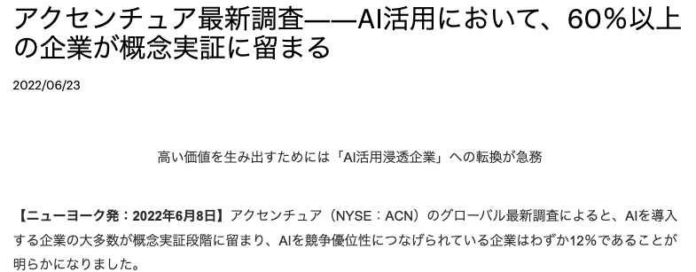
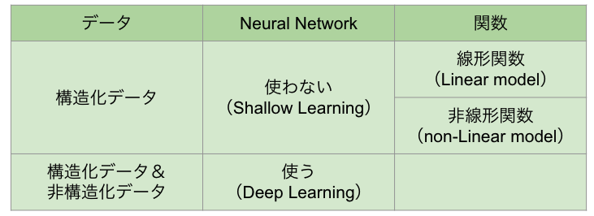

## 自己紹介

丸山 哲太郎

* 東京大学大学院工学系研究科 修了
* 富士通研究所
    * 大規模ストレージの研究開発
* リクルートコミュニケーションズ
    * Data Scientist / Machine Learning Engineer / Data Engineer
* メルカリ
    * Machine Learning Engineer / Engineering Manager
* TechnoFACE
    * Data Scientist / General Manager / 取締役

## Schedule

* １日目：テキスト分類の要素技術
    * 導入
    * テキスト分類を行うために必要な技術・手法
* ２日目：テキスト分類手法（古典から最新まで）
    * 課題の報告と検討
    * テキスト分類の手法

## Agenda（１日目）

* 導入
    * AI とは何か
    * AI は何が出来るのか
    * どのように AI を使うべきか
        * AI Lean Canvas
* テキスト分類を行うために必要な技術・手法
    * テキストの前処理
    * MeCab による形態素解析
    * FastText による単語分散表現

# 導入

## AI の動向

[https://newsroom.accenture.jp/jp/news/release-20220623.htm](https://newsroom.accenture.jp/jp/news/release-20220623.htm)

## AI の動向

* 世界的に見ても、AI を有効に使えている企業は極一部
    * AI を使って他社より良い結果を出している企業は 10% 程度
    * 半数以上の企業は「ちょっとやってみたけど、使えてない」
    * あくまで AI をやってみた企業の中で。全くやってない企業もある
* 日本だと、もっと状況は悪いだろう
    * 人材不足・データ不足・理解不足
* じゃあ、どうするのか
    * まだチャンスはある（今から始めても遅くない）
    * ただし、それほど浸透していないのには、理由がある
    * なぜ使えないのか、どうやったら使えるのか、どう使うべきなのかをしっかり把握するべき
* まずは AI （機械学習）について見直す

# AIとは何か

## AIとは何か

* AI: Artificial Intelligence（人工知能）
    * "Intelligence demonstrated by machines"
        * from Wikipedia(en) "Artificial Intelligence"
    * コンピューターによって実現される『知能』
* Intelligence（知能）
    * "The ability to perceive or infer information, and to retain it as knowledge to be applied towards adaptive behaviors within an environment or context"
        * from Wikipedia(en) "Intelligence"
    * ある環境・状況下において、適切な行動を取れるような知識として、\newline 情報を認識・推論・保持できる能力

## AI の一例

ログインシステム

* あらかじめユーザー名とパスワードがデータベースに登録されている
    * ← 情報の保持
* ユーザーがユーザー名とパスワードを入力する
    * ← 情報の認識
* ユーザー名とそのパスワードが登録されているものと一致する
    * ← 情報の推論
* そのユーザーがシステムの機能を使えるようにする
    * ← 適切な行動
* **立派な「AI」**

## AI という言葉の意味

**「AI」は「IT」と同じぐらいの、非常に広い意味を持つ**

# AI は何が出来るのか

## AI は何が出来るのか

「AI は何が出来るのか」を理解するためには、\newline
「AI にはどういう種類があるのか」を理解する必要がある。

* なんちゃって AI
* 最適化
* 機械学習（Machine Learning）
    * データの種類による分類
    * アルゴリズム（目的）による分類 ← 重要
    * 浅いか深いか

## 人生ゲーム

各自が自分の作ったルーレットを持ち込んで、人生ゲームをする。

* 人生ゲームをゴールする＝ビジネス課題（目的）
* 独自のルーレットを作る＝作るべきAI

## 人生ゲームのゴールとルーレット

* とにかく最速でゴールする！
    * 必ず10が出るルーレットを作る
    * → **ルールベース** （なんちゃってAI）
        * 単純なルールを守り動作するシステム
        * 単語に反応して答えるチャットボット
* あまり派手になり過ぎなく、それでいて最速にゴールする
    * 直近5回で合計が40になるルーレットを作る
    * → **最適化**
        * 限られた資源の中で最大の成果を得たい
        * アルバイトのスケジュールを自動で組む
* 両者とも、バグ無く動作すれば使い続けることが出来る

## AIルーレット

人生ゲームは最速でゴールすることだけが目的ではない。

* 人生ゲームをどのようにゴールしたいか（**要件**）
    * 所持金が最大、子供が最多、etc. etc...
* 要件を表すデータは何か（**目的変数**）
    * 所持金の額、子供の数、etc. etc...
* 要件を満たす予測のために必要なデータは何か（**特徴量**）
    * 駒の位置、升目の内容、etc. etc...
* 要件が満たされているか判断するデータは何か（**指標**）
    * メンバーの中での所持金ランキング、etc. etc...

## AIルーレットに必要なもの

* 要件が明確に決められている
    * 所持金最大！
* 目的変数、特徴量のデータ
    * 過去のゲームの内容と、その結果
    * 大量に！
* 指標の計算と、それがどのような値になるべきかの判断
    * 所持金が最大？どれぐらい差を付けたい？

これらを元に、「統計的に」最適解を予測するのが、AI。

* 完全なデータが無くても、データから最適解を予測する
* あくまで統計的なものであるため、間違うこともある
* なので、常に監視し、適宜判断することが必要

## 機械学習の種類（扱うデータ）

データの種類

* 構造化データ
    * テーブルデータ（Tabular Data (例) Excel, CSV）
* 非構造化データ
    * テキストデータ、画像データ、音声データ

扱うデータによる機械学習の種類

* テーブルデータ → 一般的な機械学習
* テキストデータ
    * 「自然言語処理」（NLP: Natural Language Processing）
* 画像データ
    * 「画像処理」（Image Processing）

## 機械学習の種類（教師データ）

目的変数（教師データ、正解データ）が存在しない場合もある。

* 教師データがある
    * 「教師あり学習」（Supervised Learning）
* 教師データが無い
    * ユーザーを３つのタイプに分類する
    * 「教師なし学習」（Unsupervised Learnig）
* 学習には（とりあえず）正解があるが、予測結果には正解が無い
    * 写真をモネ風に変換する
    * 「半教師あり学習」（Semi-Supervised Learning）
* はっきりとした正解は無く、スコアのみが存在する
    * AI将棋、Alpha GO
    * 「強化学習」（Reinforcement Learning）

## 機械学習の種類（アルゴリズム）

実際に機械学習に何をさせるか、そのアルゴリズムによっても種類が異なる。

* データを分類する（教師あり学習）
    * 「分類」（Classification）
* データの値を予測する（教師あり学習）
    * 「回帰」（Regression）
* データをグループ分けする（教師なし学習）
    * 「クラスタリング」（Clustering）
* データを生成する（半教師あり学習）
    * 「生成」（Generation）

下に挙げたものほど、難しい

## 機械学習の種類（目的）

[japatpoint.com](https://www.javatpoint.com/regression-vs-classification-in-machine-learning)より引用

## 機械学習の目的に対する難しさ

## 機械学習の種類（実装）

## 機械学習の種類（まとめと実際例）

# どのように AI を使うべきか

## 業務にAIを用いるイメージ：AI昔話

納豆を初めて発見した人（源義家説）

* 平安時代の中頃、東北地方で反乱があり、それを治めるため平泉に
* 農家から貰った大豆を煮ていた
* (K)急に(T)敵が(A)現れた！
* 煮ていた豆を急いで藁にくるみ、馬に乗せたりして持ち歩く
* 落ち着いた後に藁を解いてみると、ネバネバしているし、臭いも酷い
* 完全に腐ってると思うけど、もったいないから食ってみる
* うまい！
* → この臭くてネバネバする大豆をちゃんと作りたい（業務課題）

## 納豆を大量生産したい

業務課題：「納豆を作る方法を確立する」

考え得る条件：

* 大豆の処理：大豆そのまま、煮る、焼く、すり潰す、etc...
* 大豆の管理：そのまま、藁にくるむ、樽に入れる、布袋に入れる、etc...
* 大豆の保管：野ざらし、小屋に入れる、馬に載せる、人が担ぐ、etc...
* 大豆の保管期間、etc, ...

とりあえずやってみる

* いろいろな条件を試してみる
* その中から最も良い条件を探し当てる

## 納豆の作り方の確立

## 納豆作りをAIでやるならば

## 業務に AI を取り入れる

* AI に必要なもの
    * 人間の知見・経験を変換した（大量の）データ＝BigData
        * AIはどんなデータが必要か分からない
        * 人間が作る必要がある＝DX(Data eXchange)
    * 正解データ
        * AIは人間にとって何が有用なのか分からない
        * 発酵も腐敗も、細菌にとっては同じもの！
        * 人間が判断する必要がある
* AI で便利になること
    * データに隠されたルールを自動的に発見する
        * 人間が気付くより速くルールに辿り着ける、かも
    * 明確なルールが出来るので、誰でも使えるようになる
        * 経験・勘という感覚的なものではない、定量的な判断

## 本当にAIが必要ですか？

ルーレットの例を思い出す。

* 本当に必要なものは何ですか？
    * 結局、一番早くゴールしたいのでは？
    * 手段(AI)が目的になっていませんか？
* それはAIでしか実現できませんか？
    * 8,9,10 だけをランダムで出すルーレットだって可能
* コストをかけてAIを作るメリットはありますか？
    * あらかじめ分析をして十分なメリットが得られるか確認（下分析）

**AIを使わないという判断**も重要

## AIが出来ないこと

* データが無い
    * DXでデジタル化済の、大量のデータ
    * 人間がきちんとラベル付けした、正解データ
* 人間では（無限の時間をかけても）無理なこと
    * AIは人間を「模倣」します
* 業務の目的を AI 用に落とし込めていない
    * 分類・回帰（・生成）のどれかに当てはめる必要
* 必ず正解すること
    * AIは「統計的に」予測するだけ
* 即座に結果を出すこと
    * AIの結果は必ず「徐々に」現れます

## AIの目的と導入

* 例）中古車の販売価格をAIで決める
    * AIを用いる意義
        * 価格査定の人的コストを削減する
        * 価格査定担当者のスキルに依存しない、市場と連動した価格設定
    * → 「回帰」を使おう
        * →価格を正確に予測することは非常に困難→頓挫
    * 正確な販売価格は本当に必要だったのか
        * 価格帯を示すだけでも、人的コスト削減の効果は十分
        * 同様の中古車の、最新の市場価格を簡単に参照出来れば良い
    * 方針の再策定
        * 価格の「回帰」ではなく、価格帯の「分類」を行う
        * システムで市場価格の参照を行うなど、実装と運用でカバー
    * データとノウハウを蓄積し、将来の完全AI化を目指す

## AIの理想的な使い方

* 業務に関するデータを常に（自動的に）デジタルに蓄積する
    * IT化、DX
* データの可視化を行う
    * 蓄積したデータからビジネスの状態を表す指標を自動的に計算する
    * 計算された指標の値を常にグラフ等で見れるようにする
* 可視化された指標を元にビジネスの指針を決定する文化を作る
    * データドリブン
* 適切な目的を設定する
    * 小さな目的・簡単な目的・人間のサポート役から始める
* 時間と金をかけて下分析・実施検証（Proof of Concept: PoC）する
* 「AIの適用」
* AIの効果を長期的な視点で監視し、常に改善を行う

# 指標

## 指標

* ある意味、AIよりも指標の方が大事
* ビジネスの指標＝ビジネスがどういう状態かを表す数値
    * KPI (Key Performance Indicator)
    * 例）売上高
* AIの指標＝AIの予測精度がどういう状態かを表す数値
    * 例）Accuracy
* 一般的に、ビジネスの指標とAIの指標は異なる
    * AIを導入してもビジネスが良くならない根本原因
    * AIを導入する前に、AIの指標とビジネスの指標を紐付ける必要がある
* AIの指標の種類
    * 回帰：誤差
    * 分類：いっぱいある

## 分類における指標

## 分類指標についてあれこれ

* imbalance（不均衡）
    * 例えば２クラス分類の場合、Aに属するデータが100万個、Bに属するデータが1000個のように偏りがある場合、imbalance（不均衡）と言う
    * 分類問題は、不均衡であるほど、偏りが大きいほど難しい
* Accuracy（精度）は使ってはいけない
    * 特に imbalance の場合、Accuracy の値は信用出来ないので、使ってはならない
    * 上記の場合、データをすべてAに属すると言えば、Accuracy 0.999 になる

## 分類指標についてあれこれ（その２）

* Precision と Recall は、業務におけるリスクによって使い分ける
    * （たとえ見落としがあっても）間違って予測するリスクが大きければ、Precision を使う
        * 違反ユーザーを検知する：問題ないユーザーに「違反だ」と言うと、退会してしまう
    * （たとえ間違っても）漏れのリスクが大きければ、Recall を使う
        * ガンを予測する：間違って予測しても精密検査を受ければ良いが、見落としは患者の命に関わる

# AI Lean Canvas

## AI Lean Canvas

* ある業務に AI を導入したい
* その業務は本当に AI を導入すべきなのか、導入するとしたらどのようにすればよいのか
* これらを考えるツールとして、AI Lean Canvas を作成した
    * Google Presentation の形で配布します
    * ２日目までの課題とします

## AI Lean Canvas

# テキスト分類を行うために必要な技術・手法

## テキスト分類

* 扱うデータ：テキストデータ（非構造化データ）
    * 自然言語処理（NLP: Natural Language Processing）
* 機械学習の目的：分類
    * NLP の中では最も簡単
* 想定される適用シーン
    * ユーザーからの要望を適切に担当部署に自動転送
    * 不適切なコメントの自動発見・削除

## NLPの基礎技術：形態素解析

* 日本語は、文章において単語の切れ目が無い
    * This is a pen.
    * これはペンです。
* まず文章を単語に切り分けることが必要
    * 形態素解析
    * 今回は MeCab というツール（アプリ）を使う
* MeCab
    * 辞書を利用する（IPA辞書）
        * 日本語の単語一覧
        * 隣り合う単語、隣り合わない単語を表すスコア
    * 文章の先頭から辞書の単語を当てはめていき、一番尤もらしい分け方・単語を探す

## 形態素解析において考えるべき点

* どの辞書を使うか
    * IPA辞書：基本的な単語しか収録されていないが、安定した分析ができる
    * JUMAN辞書：変化型に対して強いため、時制の分析などに強い
    * IPA NEologd辞書：新しい単語も取り入れているが、不安定になることも
* どの品詞を使うか
    * Deep Learning でない場合、てにをはを解析しても意味がない
        * 文章の大まかな意味を汲み取りたいだけ
    * まずは使用する品詞を決定し、それ以外の品詞である単語を除外する
        * 名詞だけ
        * 名詞＋動詞＋形容詞

## 形態素解析において考えるべき点２

* 表層型か、原型か
    * 「走る」と「走った」を区別すべきか
    * 全部原型に直した方が出現頻度が多くなるので学習しやすい
    * しかし原型に直すということは意味を変えてしまうということでもある
* STOP WORD
    * ほとんどすべての文章に出てくるような単語がある
        * 「てにをは」のような接続詞
        * 「ある」「いる」のような一部の動詞
    * このような単語（STOP WORD）は、文章の意味とはほぼ関係がない
    * STOP WORD を適切に除外していく必要がある

## NLPの基礎技術：単語分散表現

* 機械（AI）は単語を理解する、わけではない
    * 機械が処理できるのは、数値
* 最も簡単な、単語をベクトル化する方法
    * 日本語の全単語を順番に並べ、その単語が含まれる個数に変換
        * 「明日」という単語 → 「明日」の所だけ1、他は0のベクトル
        * 文章 → その文章に含まれる単語の数をベクトルにする
    * ものすごく巨大なデータになってしまう
* 画期的な方法：単語分散表現（WORD2VEC）

## WORD2VEC

## WORD2VEC

* 「２つの単語の意味の違い」は、「２つのベクトルの角度の違い」
    * 位置の違い（距離）ではないことに注意
* ベクトルなので、足し算引き算が出来る
* MAN と WOMAN, UNCLE と ANT, KING と QUEEN の違いは、どれも男と女
* それらのベクトルの引き算の結果（MANから WOMAN に向かう矢印）は、どれも同じになる
* 足し算引き算をすることで「どれだけ単語を精度良くベクトル化できたか」が検証できる
    * KINGS から KING を引く→「複数」という意味が残るだろう
    * その結果に QUEEN を足す → QUEEN の複数、すなわち QUEENS になるだろう

## ハンズオンで使用するデータ

* 日本語で一般的に公開されているデータは、ほぼ無い
* 唯一と言って良いものが、[livedoor ニュースコーパス](http://www.rondhuit.com/download.html#ldcc)
    * 2012年9月上旬に公開されたニュースのテキストデータ
    * NHN Japan 株式会社が運営する「livedoorニュース」のうち、９つのジャンルからニュース記事を収集したもの
* 今回のセミナーは、全体を通してこのデータをサンプルデータとして用います
    * ハンズオンの関係上、９つのジャンルのうち３つのみを用います

# ２日目までの課題

## ２日目までの課題

* AI Lean Canvas を書いてみる
    * 今、AI を使って何かをしようと考えていること
    * こんなことが出来るんじゃないかと考えていること
    * テキスト分類じゃなくても構いません
    * ２日目に発表して頂き、私と共にディスカッションしましょう
* 単語の足し算・引き算で、興味深い結果になるものを発見する
    * Google Collaboratory 上で遊んでみましょう
    * 面白いものを発見したら、２日目に教えて下さい
