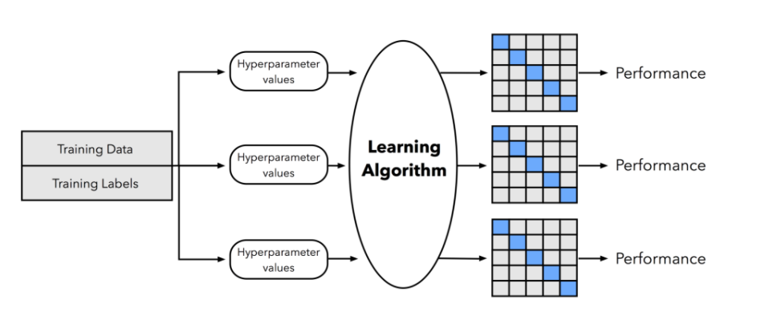

## Schedule

* １日目：テキスト分類の要素技術
    * 導入
    * テキスト分類を行うために必要な技術・手法
* ２日目：テキスト分類手法（古典から最新まで）
    * 課題の報告と検討
    * テキスト分類の手法

## Agenda（２日目）

* 課題の報告と検討
    * 面白い文字の足し算・引き算
    * AI Lean Canvas
* テキスト分類の手法
    * Support Vector Machine
        * Shallow Learning（線形関数）
    * TextCNN
        * Deep Learning
    * 最新事例紹介
        * BERT

# テキスト分類の手法

## （復習）機械学習の種類（実装）

## ちょっとした疑問

Shallow Learning の非線形関数は使わないのか？

* Word2Vec で単語を 300 次元のベクトルに変換した
* 300 個の特徴は、結構多い
    * ただでさえ多い特徴量に非線形関数かましたら死ぬ
    * 次元の呪い

## データの落とし穴：次元の呪い

* N次元の直方体とそれに内接する球があったとする
    * ２次元なら正方形と円、３次元なら立方体と球
* 立方体に満遍なく点があった時に、どれぐらいが球の中にあるか
    * ２次元の場合は、ほとんどが円の中に入るだろう
    * ３次元の場合は、２次元に比べて隙間が多いので、球からはみでる
* ではもっと次元数が大きくなったら？
    * 無理やり球で考えると、立方体はトゲトゲのウニみたいな形になる！

## 次元の呪いとNLP

* いくらデータを揃えても、そのデータはほとんど空間のすみっこに存在し、疎（sparse：スカスカ）な状態になる
    * これではまともな分析は出来ない
* 空間をスパっと２つに分けるだけでも、ちょっとでも切る位置や角度が違うだけで全然違う結果になってしまう
    * 微妙な誤差が結果に深刻な影響を与えてしまう
* 空間をぐねぐねとした曲線で分ける非線形モデルは、もっとヤバい
    * NLPで用いる Shallow Learning は、大概、線形モデル

## 線形モデルと非線形モデル

scikit-learn.orgより引用

## 機械学習の適用方法

* データの正規化
    * 数字データだったら、「平均０分散１」にする
    * 文字データだったら、半角全角などを揃える
* データを学習用・評価用に分ける
* Hyper Parameter Search 兼 Cross Validation
    * AI で最も避けるべき点＝過学習
    * 学習用データをさらに学習用・評価用に分ける
    * 過学習を防ぐと同時に、最適なパラメータを探す

## Hyper Parameter

モデルにとってパラメータはデータ（特徴量）そのものなので、\newline
モデル自体のパラメータをHyper Parameterと呼ぶ

* データによって、最適なHyper Parameterの値は異なる
    * 切る線の太さ、使う木の数 etc. etc...
* 同じデータを用いて、何種類もの異なるHyper Parameterで試し、最も精度が良くなるHyper Parameter を探す
    * 「Hyper Parameter Search」
* 探索方法
    * Grid Search : 一定の間隔で変化させる
    * Randomized Search : ランダムに変化させる
    * Randomized Search の方が効率的であることが証明されている

## モデルの最も大きい落とし穴：過学習

* そのモデルは、学習用データのみで良い精度を出すのかもしれない
    * 実際に運用し始めて、新しいデータで予測をしたら、非常に悪い結果に
    * AIで最も避けなければいけない事
    * 「過学習」
        * 要するに「マンモスの牙」
* 必ず過学習を防ぐ対策を講じなければならない
    * Shallow Learning: Cross Validation
    * Deep Learning: SGD, dropout, etc. etc...

## Cross Validation

* 学習用データをさらに何個かに分ける
    * 例えば5個
* 5個のうち4個を使い学習、1個を使い評価
    * 評価に使う1個をずらすことで、5通り学習・評価する
* その評価値を5通りで平均したものを、最終的な評価値とする

## データの分割と利用のまとめ

全ページの図含め、[Ethen](http://ethen8181.github.io/machine-learning/model_selection/model_selection.html)より引用

## Support Vector Machine

* Shallow Learning の線形モデル
* 直線でスパッと切るが、その線をある程度太くして、曖昧に出来る
    * "Margin"
* 探索すべきHyper Parameter
    * Regularization parameter: C （Margin の太さ）

## Support Vector Machine の概念図

[Wikipedia](https://ja.wikipedia.org/wiki/%E3%82%B5%E3%83%9D%E3%83%BC%E3%83%88%E3%83%99%E3%82%AF%E3%82%BF%E3%83%BC%E3%83%9E%E3%82%B7%E3%83%B3)より引用

# Deep Learning

## Deep Learning って何が良いの？

* どんな問題でも良い予測ができることが理論的に証明されている
    * 任意の関数を近似することが出来る
    * それを実際に見つけることが出来るのか、は別問題
* 非構造化データをそのまま扱うことが出来る
    * 絵は絵のまま、文字は文字のまま
        * 直感的に分かりやすい
    * もちろん、どこかでデジタルに変換している

## Deep Learning の悪い点

* 複雑で計算量が多い
    * 脳（神経細胞・シナプス）の構造を模倣しようとしたもの
    * ユニット（＝シナプス）をつなぎ合わせたレイヤーを何層も重ねる
    * 実質的に GPU 等が必須
* HyperParameterの探索が困難
    * レイヤーの大きさは？何層必要？このレイヤーで良いの？
* 何をしているのかが分かりにくい

Deep Learning が必ずしも最適とは限らない

## Deep Learning のフレームワーク

* ２大フレームワーク
    * TensorFlow
        * Google 製
    * PyTorch
        * コミュニティ製
* 便利ライブラリ
    * TensorFlow → Keras
        * TensorFlow 内部に組み込み済み
    * PyTorch → PyTorch Lightning, skorch

今回は PyTorch および skorch を使う

## TextCNN

* [Convolutional Neural Networks for Sentence Classification](https://arxiv.org/abs/1408.5882), Yoon Kim, 2014
* 一般的に画像に用いられてきた CNN (Convolutional Neural Network）をテキストに適用
    * Convolutional : 畳み込み
    * 画像の場合は、あるピクセル周辺の情報をまとめあげる
    * テキストの場合は、ある単語周辺の情報をまとめあげる（N-gram）

## TextCNN

## TextCNN がやってること

* 前処理
    * 文章を単語に分割し、学習済みの Word2Vec における何番目の単語か（インデックス）に変換する
* モデル
    * Word2Vec の学習済みベクトルを取り込んでいるので、インデックスからベクトルに変換
    * 正規化
    * Convolutional 層を何枚か並列に並べ、N-gram の特徴を抽出
    * Max Pooling 層を同じ枚数並列に並べ、最大の特徴を持つものを抽出
    * 線形全結合層で学習
        * dropout を設定して過学習を防ぐ
    * softmax をかけて最終的にどのカテゴリに分類されるか決定する

## ハンズオンでの TextCNN の実装

* 非常に論文に忠実に実装
* インデックスをベクトルに変換する Embedding 層の実装
    * 学習済み Word2Vec をそのまま使う static embedding layer
    * ベクトルの値も学習していく fine-tuning embeding layer
* ２つのモードを搭載（Hyper Parameter "input\_channel")
    * static embedding layer のみを用いる "static"
    * 両方用いる "multi"
* どのような Convolutional 層を何層重ねるかを設定可能
    * Hyper Parameter "kernel"

# 最新事例紹介

## NLP界隈の最新事例

* Attention から Transformers へ
* BERT (Bidirectional Encoder Representation from Transformers)
    * Google 社が発表（2018年）
    * この数年で最も注目されている NLP モデル
        * 厳密に言うと、前処理
        * それまでのトップスコアをほとんど塗り替えた
        * [SotA](https://paperswithcode.com/sota) (State ot the Art)
    * 急速にコモデティ化
        * Hugging Face 社の transformers（無料）
* GPT-3
    * OpenAI 社が発表（2020年）
    * 物凄いらしいが、非公開だし、すごいインフラが必要
    * Microsoft Azure 上の API として利用可能（有料）

## BERT とは

* Transformers の Encoder をいっぱい重ねて作ったもの
* より詳しく知るには
    * [Attention Is All You Need](https://arxiv.org/abs/1706.03762)

## Hugging Face 社 Transformers

* Hugging Face 社が提供している Python ライブラリ [Transformers](https://huggingface.co/docs/transformers/index)
    * Google 社が実装したものより、こちらが主流になっている
    * BERT だけではなく、BERT 派生モデルも収録されている
        * OpenAI GPT-2 も収録
    * PyTorch だけではなく（一部だが）TensorFlow にも対応
    * 英語 Wikipedia の学習済みバイナリも同時に配布
* 日本語 Wikipedia を学習した 日本語対応 BERT
    * [東北大学乾研究室](https://www.nlp.ecei.tohoku.ac.jp/news-release/3284/)にて作成
    * 利用可能な学習済みバイナリとして Transformers に収録されている
* モデルだけではなく、Tokenizer も配布
    * Tokenizer の学習済みバイナリも配布
    * 上記日本語学習済み Tokenizer も配布

## Word2Vec と BERT の比較

* BERT 単体で見れば、モデルではなく前処理
    * Word2Vec のように、単語をベクトルに変換するもの
* 生成するベクトル
    * Word2Vec の場合、Wikipedia 級のテキスト量を学習する際には、300次元のベクトルにすることが妥当
    * （Transformers の）BERT は 768 次元ベクトルに変換
* 単語のベクトルから文書のベクトルに
    * Word2Vec の場合、各単語のベクトルを正規化（長さ１）にし、平均
    * BERT の場合
        * 先頭の特殊メタ文字 "[CLS]" のベクトルを採用する
        * 全部のベクトルを平均する
        * 今回は後者を採用

## BERT の使い方

* どのように使っても OK
    * 生成したベクトルを Support Vector Machine で学習する
    * BERT の下に任意のレイヤーをつなぎ、ひとつのモデルにする
* Transformers に収録されているモデル
    * BertForMaskedLM
        * 文章の穴埋め問題（文章中の四角に入る単語は何？）
    * BertForNextSentencePrediction
        * ある文章があり、その次にこの文章が続くのは妥当か？
    * BertForSequenceClassification
        * テキスト分類
    * BertForMultipleChoice
        * この文章の要約として妥当なものは次のどの短文か？
    * BertForQuestionAnswering
        * この質問文の答えとしてこの短文は妥当か？

## 流行りの BERT 利用方法

* キーワード検索
    * 例）Google の検索
    * キーワードが正確でないと、欲しい情報が手に入らない可能性
        * 「組み合わせ理論」と検索しても、「組合せ理論」と書かれているページは出てこない
* ベクトル近傍検索
    * あらかじめ情報をすべてベクトル化しておく
    * 検索キーワードをベクトル化する
    * 検索キーワードのベクトルに最も近いものが欲しい物
    * メリット
        * 多少表記が異なっていても（学習できていれば）意味の近さで検索可能
* 一般的な全文検索とベクトル近傍検索を組み合わせる
