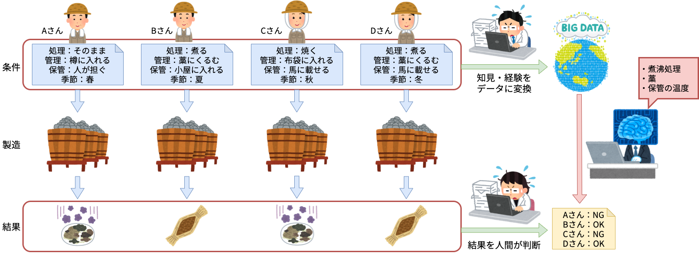

# Agenda

* Introduction
    * What is "AI"
* Application of "AI" to the business
    * Significanse for "AI"
* Variations of "AI"
    * What we might be able to do using "AI"
    * What to do and not to do using "AI"
* Introducing "AI" into the business
    * Successful and unsuccessful examples

# Introduction

* 本発表について
    * AIとは何をするものなのか、何が出来るのか、私の見解を示す
    * 数式は一切使わない
* そもそもAIとは何か
    * 言葉の定義から
* 業務にAIを使う典型例から、AIとは何かを導き出す
    * 納豆の例

## What is "AI" ?

* AI: Artificial Intelligence（人工知能）
    * "Intelligence demonstrated by machines"
        * from Wikipedia(en) "Artificial Intelligence"
    * コンピューターによって実現される『知能』
* Intelligence（知能）
    * "The ability to perceive or infer information, and to retain it as knowledge to be applied towards adaptive behaviors within an environment or context"
        * from Wikipedia(en) "Intelligence"
    * ある環境・状況下において、適切な行動を取れるような知識として、\newline 情報を認識・推論・保持できる能力

## The most simple example of "AI"

ログインシステム

* あらかじめユーザー名とパスワードがデータベースに登録されている
    * ← 情報の保持
* ユーザーがユーザー名とパスワードを入力する
    * ← 情報の認識
* ユーザー名とそのパスワードが登録されているものと一致する
    * ← 情報の推論
* そのユーザーがシステムの機能を使えるようにする
    * ← 適切な行動
* **立派な「AI」**

## The definition of "AI"

**「AI」は「IT」と同じぐらいの意味**

## People who ate NATTO for the first time

（源義家説）

* 平安時代の中頃、東北地方で反乱があり、それを治めるため平泉に
* 農家から貰った大豆を煮ていた
* (K)急に(T)敵が(A)現れた！
* 煮ていた豆を急いで藁にくるみ、馬に乗せたりして持ち歩く
* 落ち着いた後に藁を解いてみると、ネバネバしているし、臭いも酷い
* 完全に腐ってると思うけど、もったいないから食ってみる
* うまい！ → この臭くてネバネバする大豆をちゃんと作りたい（業務課題）

## Making NATTO as a business issue

業務課題：「納豆を作る方法を確立する」

考え得る条件：

* 大豆の処理：大豆そのまま、煮る、焼く、すり潰す、etc...
* 大豆の管理：そのまま、藁にくるむ、樽に入れる、布袋に入れる、etc...
* 大豆の保管：野ざらし、小屋に入れる、馬に載せる、人が担ぐ、etc...
* 大豆の保管期間、etc, ...

## Make NATTO by trial and error

## Make NATTO using "AI"

## What is "AI"

* AIとは何か
    * 人間が得るであろう知見を、機械的な手法でデータから抽出する
        * ≒「データから真理を導き出す」
* AIに必要なもの
    * 人間の知見・経験を変換したデータ
        * AIはどんなデータが必要か分からないので、人間が作る
    * 大量のデータ
        * 全部のデータを人間が作るのは困難なので、IT・DXが必要
    * 正解データ（ラベル付け、アノテーション）
        * 何が人間にとって有用なのか分からないので、人間が作る

# Application of "AI" to the business

* AIのメリット/デメリット
* AIを使う意義

## Comparison of "AI" and humans

||人間|AI|
|:---:|:---:|:---:|
|知識の獲得方法|長期間かけて経験を積む|大量のデータから一気に|
|認識・推論|暗黙的で高度な意味推論|データから明示的に|
|データの利用方法|暗黙的で高度な意味推論|データにあるものだけ|
|知識の保持|暗黙知|データで明示的に|
|扱える対象|個人の能力で限界あり|人間が見れる以上の大量データ|
|判断の基準|主観的|客観的（データは主観的かも）|
|可能性の探索|能動的に行うことが可能|人間が与える必要（受動的）|
|柔軟な判断|難しい|データが有れば簡単|
|新規発見の可能性|難しい（試行錯誤が必要）|難しい（試行錯誤が必要）|

## Pros of using "AI"

* （単純作業である）人的工数の削減
    * 他の新規開発・創造的業務に人的工数を当てることが出来る
* データという客観的事実による判断
    * 熟練者でなくても業務を遂行することが可能
    * 経営的判断にも使うべき
* データからルールを自動的に作成
    * 実際にはまだ起こっていない状況からの結果を「予測」できる
        * 新規発見、将来予測
* 人間が把握出来ないルールの発見
    * 大量のデータから正しいルールを導き出す
    * ただし、ほとんどの場合が「当たり前の結論」
        * 砂漠の中に埋もれた一粒のダイヤモンドを探すよう
* 宣伝材料になる

## Cons of using "AI"

* 学習をするための大量のデータが必要
    * 所謂「ビッグデータ」
* データがデジタル化されていることが必要
    * AIが使うデータだけではなく、社内のあらゆることがデジタル化され、\newline それが常に監視（モニタリング）できる状態であることが理想
* 下分析が必要で、これだけでも時間とお金がかかる
    * データを分析してみないと何も分からない
* 効果が出るまでに時間がかかる
    * 即改善することは稀。徐々に変わっていく
* 継続的に監視・改善していくことが必要
    * 環境や人間の行動は徐々に変わっていく

## Anti-patterns of using "AI"

* 「AIをやる」ことが目的となっている
    * AIはただの手段。手段と目的を履き違えない
* いきなり難しい事・理想の事をやろうとする
    * まずは簡単な事・導入しやすい事から始める
* データはあるが、紙の書類のみ
* 結果をすぐに求める
    * 下分析が必要
    * 学習し予測した結果が効果を発揮するまでには時間がかかる
* 分析結果・予測結果を無視する
    * 環境や人間の行動の変化に柔軟に対応する（データドリブン）
* 作ったらそれで完了だと思う
    * ITと最も異なる点（"AI"には絶対的な正解が無い）

## Successful patterns of using "AI"

* 既に業務全体のデジタル化＆データドリブン(DX)が完了している
* 人手でやっている困難・煩雑な作業の工数削減をまずは目指す
* 完全にAIに任せるのではなく、人間のサポート的な役割から始める
* しっかりと下分析を行ってから実際の業務に導入する
* 定期的にデータを見て判断する、というシステムおよび習慣がある
* 短期間で短絡的に判断せず、長期的な視点で判断する
* 分析から得られた点から徐々に難しいことに応用していく

## Significance for using "AI"

* 人間の工数を削減する
    * IT と同じレベル
* データという客観的事実に基づく判断を行う
    * 主観的な判断よりも正しいかもしれない
    * 勘や経験を明文化（デジタル化）し、汎用化・継承を容易に
* 環境や状況の変化に対して即座に反応する
    * 自動的にデータが蓄積され、それを常に監視し、判断する
* 新しい発想・技術を積極的に採用し、\newline 自分自身（企業自身）が変化・対応できる体質になる

変化が大きく激しい時代の中で、コスト（時間・お金）をかけてでも、\newline
自己変革し、継続・発展していくという意思を持たなければならない。

# Variations of "AI"

* AIで何が出来るかを理解するためには\newline AIの種類を理解しなければならない
* "AI"と呼ばれる技術
    * なんちゃってAI/最適化/機械学習の違いを人生ゲームの例えで
* 機械学習の種類
    * データ/アルゴリズム/モデルによる分類
* AIで出来ること/出来ないこと/しないこと

## Technologies generally said to be included in "AI"

* なんちゃってAI（ルールベース、ほぼITなAI）
    * 人間が作ったルールに則って、情報を処理する
        * 例：「登録されたユーザーなら使ってOK」
* 最適化
    * 資源を、ある条件に従い、最適になるよう分配する
        * 例：「バイトのスケジュールを自動的に調整する」
        * 学習は行わない
* 機械学習（ML: Machine Learning、狭義のAI）
    * データを学習し、そこからルールを発見し、情報を処理する

## The Game of Life using "AI"

各自が自分の作ったルーレットを持ち込んで、人生ゲームをする。

* 人生ゲームをゴールする＝ビジネス課題（目的）
* 独自のルーレットを作る＝作るべきAI

## Various objectives and suitable roulettes

* とにかく最速でゴールする！
    * 必ず10が出るルーレットを作る
    * → **ルールベース**
        * 単純なルールを守り動作するシステム
        * 期待する出力が一定
* あまり派手になり過ぎなく、それでいて最速にゴールする
    * 直近5回で合計が40になるルーレットを作る
    * → **最適化**
        * 限られた資源の中で最大の成果を得たい
        * 期待する出力は不定
* 両者とも、バグ無く動作すれば使い続けることが出来る

## Things necessary for the "AI" roulette

人生ゲームは最速でゴールすることだけが目的ではない。

* 人生ゲームをどのようにゴールしたいか（**要件**）
    * 所持金が最大、子供が最多、etc. etc...
* 要件を表すデータは何か（**目的変数**）
    * 所持金の額、子供の数、etc. etc...
* 要件を満たす予測のために必要なデータは何か（**特徴量**）
    * 駒の位置、升目の内容、etc. etc...
* 要件が満たされているか判断するデータは何か（**指標**）
    * メンバーの中での所持金ランキング、etc. etc...

## Conditions necessary for the ML roulette

* 要件が明確に決められている
    * 所持金最大！
* 目的変数、特徴量のデータ
    * 過去のゲームの内容と、その結果
    * 大量に！
* 指標の計算と、それがどのような値になるべきかの判断
    * 所持金が最大？どれぐらい差を付けたい？

これらを元に、「統計的に」最適解を予測するのが、機械学習。

* 完全なデータが無くても、データから最適解を予測する
* あくまで統計的なものであるため、間違うこともある
* なので、常に監視し、適宜判断することが必要

## Do you really need the ML roulette ?

* 本当に必要なものは何ですか？
    * 結局、一番早くゴールしたいのでは？
* それはMLでしか実現できませんか？
    * 8,9,10 だけをランダムで出すルーレットだって可能
* コストをかけてMLを作るメリットはありますか？
    * あらかじめ分析をして十分なメリットが得られるか確認（下分析）
* MLでなくとも、指標を常に監視することは必要
    * → **データドリブン**
    * 優先度は、デジタル化＞データパイプライン＞データドリブン＞AI

**AIを使わないという判断**も重要

## Variations of ML depends on data type

* 構造化データ
    * テーブルデータ（Tabular Data (例) Excel, CSV）
* 非構造化データ
    * テキストデータ、画像データ、音声データ

扱うデータによる機械学習の種類

* テーブルデータ
    * 一般的な機械学習（「データ分析」）
* テキストデータ
    * 「自然言語処理」（NLP: Natural Language Processing）
* 画像データ
    * 「画像処理」（Image Processing）

## [side note] Finer variations of Data Analysis

* データが時系列データ
    * 株価を予測したい
    * 「時系列解析」（Time-Series Analysis）
* 各々の特徴量が結果にどのような影響を与えるか知りたい
    * 宣伝メール送信を100人増やしたら、販売数がどれだけ増えるか予測したい
    * 「因果解析」（Causal Analysis）
* 特徴量間の暗黙的な関係・因子を知りたい
    * アンケート結果から、20代女性が好む商品要素を特定したい
    * 「共分散構造解析」（Covariance Structure Analysis）

それぞれが難しい手法であり、すべてをマスターする人は非常に少ない。

## Variations of ML depends on objective

目的変数（教師データ、正解データ）が存在しない場合もある。

* 教師データがある
    * 「教師あり学習」（Supervised Learning）
* 教師データが無い
    * ユーザーを３つのタイプに分類する
    * 「教師なし学習」（Unsupervised Learnig）
* 学習には（とりあえず）正解があるが、予測結果には正解が無い
    * 写真をゴッホ風に変換する
    * 「半教師あり学習」（Semi-Supervised Learning）
* はっきりとした正解は無く、スコアのみが存在する
    * AI将棋、Alpha GO
    * 「強化学習」（Reinforcement Learning）

## Variations of ML depends on algorithm

実際に機械学習に何をさせるか、そのアルゴリズムによっても種類が異なる。

* データを分類する（教師あり学習）
    * 「分類」（Classification）
* データの値を予測する（教師あり学習）
    * 「回帰」（Regression）
* データをグループ分けする（教師なし学習）
    * 「クラスタリング」（Clustering）
* データを生成する（半教師あり学習）
    * 「生成」（Generation）

下に挙げたものほど、難しい

## Variations of ML depends on algorithm

[japatpoint.com](https://www.javatpoint.com/regression-vs-classification-in-machine-learning)より引用

## Variations of ML depends on model

* Neural Network を使わないもの
    * Shallow Learning
    * 非構造化データを扱う場合は、それを必ず数値に変換する必要がある
    * 線形モデル・非線形モデル・木型モデルがある
* Neural Network を使うもの
    * Deep Learning（深層学習）
    * 非構造化データをそのまま取り扱うことが出来る

Deep Learningはすべての問題に適用できることが理論的に証明されているが、
すべてのケースで Deep Learning が最善とは限らない。

また、Deep Learningは学習が難しかったり、より計算能力の高いマシン（GPU）
が必要だったりする。

## Variations of ML

## Things that AI can / can't do

* ビジネス上の課題（問題点、実現したいこと）が存在する
* 人間がそれを解決する場合はどうするかを考える
    * 人間が（無限の時間をかけても）出来ないことは、AI でも出来ない
* AI以外の方法でそれを解決できるかどうかを考える
    * AI以外の方法で解決できるなら、それに越したことはない
* AIでそれが実現できるかどうかを考える
    * 今までに挙げた機械学習の種類のうち、必要なものはどれか
        * データの種類はどれか
        * 目的変数はあるか
        * ビジネス課題を解決するために何が必要か

## Things nessesary to solve the business issue

* 例）中古車の販売価格をAIで決める
    * AIを用いる意義
        * 価格査定の人的コストを削減する
        * 価格査定担当者のスキルに依存しない、市場と連動した価格設定
    * → 「回帰」を使おう
        * →価格を正確に予測することは非常に困難→頓挫
    * 正確な販売価格は本当に必要だったのか
        * 価格帯を示すだけでも、人的コスト削減の効果は十分
        * 同様の中古車の、最新の市場価格を簡単に参照出来れば良い
    * 方針の再策定
        * 価格の「回帰」ではなく、価格帯の「分類」を行う
        * システムで市場価格の参照を行うなど、実装と運用でカバー
    * データとノウハウを蓄積し、将来の完全AI化を目指す

## Things that AI can / can't / don't do

* ビジネス上の課題（問題点、実現したいこと）が存在する
* 人間がそれを解決する場合はどうするかを考える
    * 人間が（無限の時間をかけても）出来ないことは、AI でも出来ない
* AI以外の方法でそれを解決できるかどうかを考える
    * AI以外の方法で解決できるなら、それに越したことはない
* AIでそれが実現できるかどうかを考える
    * 今までに挙げた機械学習の種類のうち、必要なものはどれか
        * データの種類はどれか、目的変数はあるか
        * ビジネス課題を解決するために何が必要か
* もっと簡単に、もっと効果的に実現出来ないか考える
    * AIの役割を必要最小限に留め、より簡単な手法で実現する
    * 人間のサポートの役割に留める、システム・運用でカバーする

## Deference between ML metrics and KPI

AIの精度指標はビジネスKPIではない

* KPI (Key Performance Indicator)
    * 目標を達成する上で、その達成度合いを計測するための指標
    * 企業の究極の目標は利益なので、最も単純なKPIは、利益高
* 例）AIの指標：Precision、KPI：利益高
    * Precisionが上がると、利益高が本当に上がるかは、定かではない
    * Precisionが〇〇の場合、売上が××上がるだろうが、コストが△△かかるので、結果的に利益高は□□上がる
    * 等の見積もりを立てて、AIの指標とKPIを結び付ける必要がある
* AIを導入しても何も得られなかった、ということを防ぐために
* **これが最も難しい問題ではないかと思う**
    * AI は目的ではなく、単なる手段（ツール）

# Introducing "AI" into the business

* AI Lean Canvas
    * 実例紹介

## Introducing "AI" into the business

AI導入にあたり、よく問題となる点

* 急激な改革（AI導入）が反発を生む
* AI導入のコストが大きすぎて、逆に企業としての体力が弱る

「AI を導入する」ではなく「何をどう AI 化するのか」が重要

* 小さな問題から、着実に改善し利益をあげていく
    * AI化を出来る/出来ない もしくは すべき/すべきではない
    * AI化したら何がどう良くなって、それは満足できる改善なのか
    * そもそもAIが使えるデータは存在するのか
    * AIは何を改善し、その結果はビジネスにどう結びつくのか

## The AI Lean Canvas

* AIを導入する際に考えるべきこと
    * ビジネス上の課題（問題点、実現したいこと）が存在する
    * 人間がそれを解決する場合はどうするかを考える
        * 人間が（無限の時間をかけても）出来ないことは、AI でも出来ない
    * AI以外の方法でそれを解決できるかどうかを考える
    * AIでそれが実現できるかどうかを考える
    * それが本当に効果があるか（ありそうか）を考える
* AI Lean Canvas
    * 上記を考えやすくするツールとして「AI Lean Canvas」を作った
    * [Lean Canvasとは](https://monstar-lab.com/dx/solution/lean-canvas/)

## Usage of the AI Lean Canvas

## Successful pattern (1)

## Successful ? pattern (2)

## The end of Successful ? pattern (2)

## Anti-pattern (3)

## The end of Anti-pattern (3)

## The end of Anti-pattern (3) (Cont.)

## Anti-pattern (4)

## The end of Anti-pattern (4)

## The end of Anti-pattern (4) (Cont.)

# Conclusion

## Conclusion

* AIは単なるツールだが、継続的な改善・発展と自己改革の呼び水
* Simple is the best. AIを使わない、簡単なAIを使うことを考える
* AIをやる前にまずはデジタル化！パイプライン！データドリブン！
* AIの理解は必要だが、肝心な所だけざっくり理解すれば十分
* その代わり、業務理解と正しいAI・指標の運用が必要
* エンジニアとマネジメントの両方に、双方への理解と意欲が必要

# Appendix

## Tasks of Data Scientist

* 業務理解・データ入手
* 前処理
    * 最も大変・・・
* 使うべきアルゴリズムの選択
    * 分類？回帰？本当に顧客が欲しかったものは？
* 使うべき指標の選択
    * 目的に沿った（目的を満たす）指標は？
* モデルの選択
    * Shallow/Deep, 線形/非線形/木
* HyperParameter探索
    * 機械学習モデルのパラメータ
* モデル・指標の試行錯誤、指標の監視と試行錯誤

## IT, DX, AI...

* デジタル化：データをデジタル化する
* データパイプライン：日々生成されるデータを自動的に取り込む
* データドリブン：データを可視化して、それに基づく判断を行う
* AI

DXって何だ？

* IT = デジタル化＋データパイプライン
* DX = データパイプライン＋データドリブン

## Visualization

* データは本当に理解しにくい
* 色んなものをどんどん可視化して、少しでも分かりやすく
    * KPI、AIの指標、AIがどんな予測をしたのか
* 可視化はデータドリブンとAIの基本
* （個人的な意見）モデル説明とデータ可視化をしない Data Scientist は信用できない

## Awesome example of Data Driven

* AI導入よりも、会社をデータドリブンに変えていく方が難しい
* 世界的に見ても素晴らしいデータドリブンの成功事例は、ワークマン
    * ただしExcelだけど・・・
* [ワークマンは商品を変えずに売り方を変えただけでなぜ２倍売れたのか](https://www.amazon.co.jp/dp/4296106724/)
    * データサイエンスではなく、ビジネスサイエンス
    * A/Bテストについても言及
